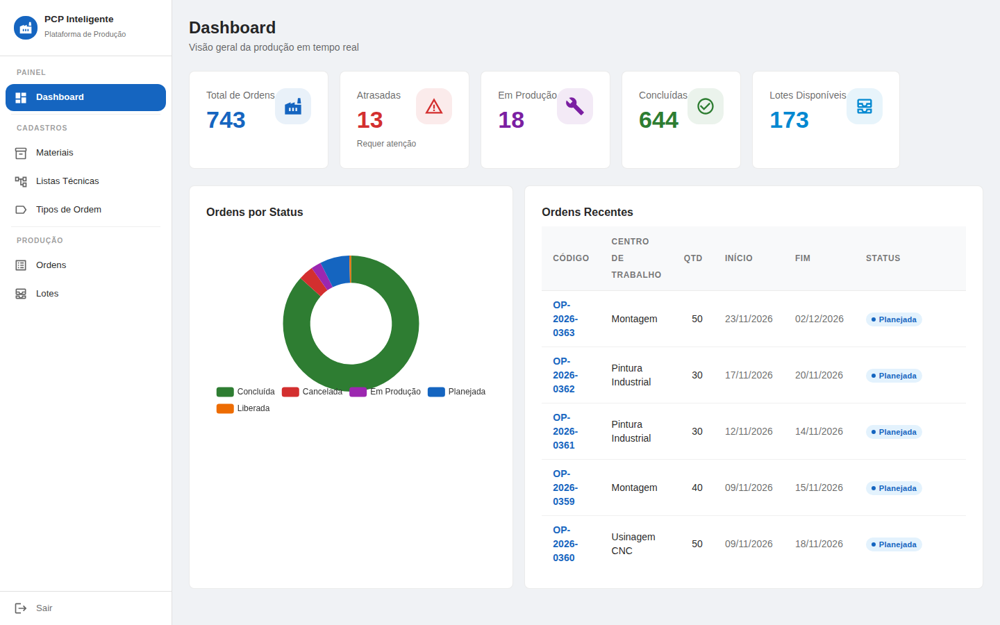
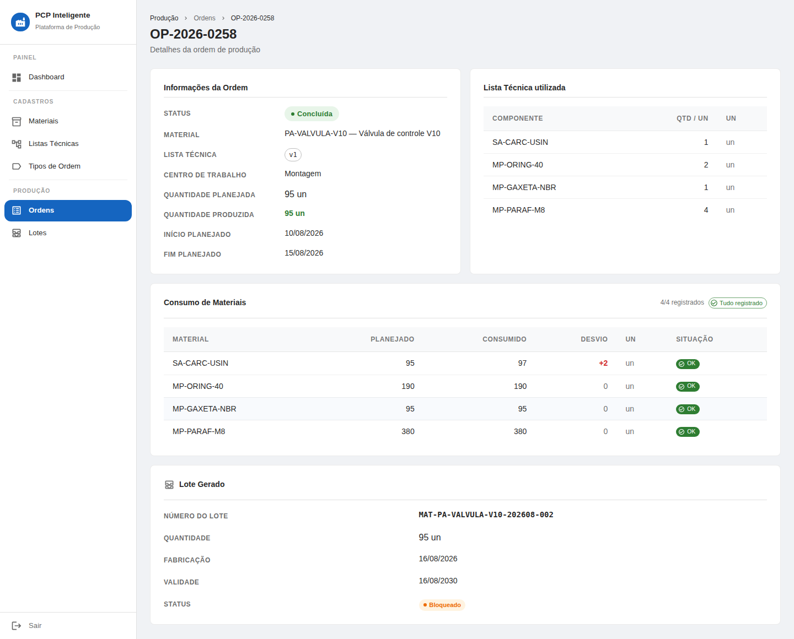
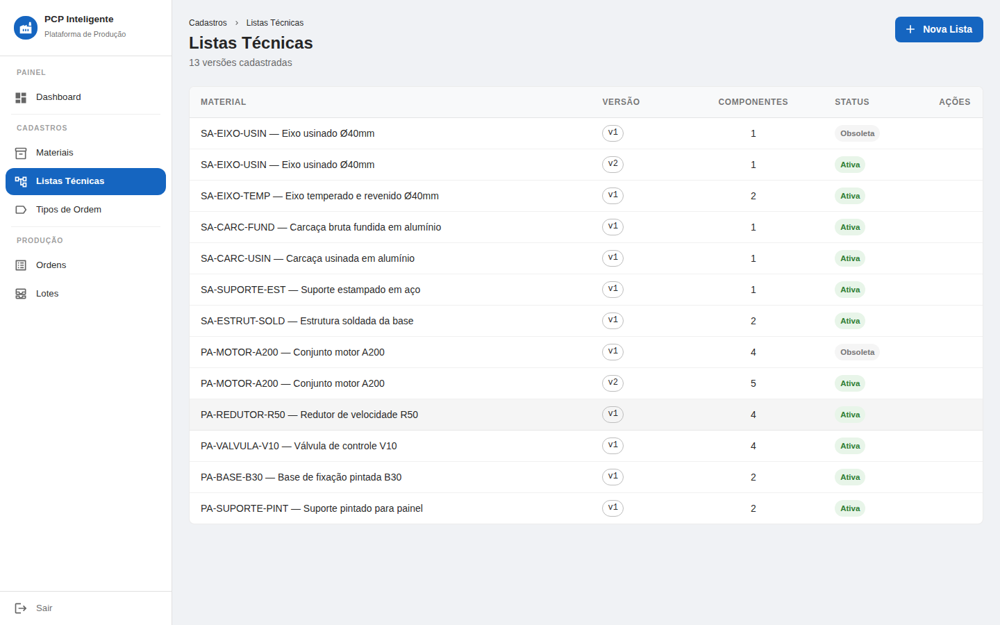
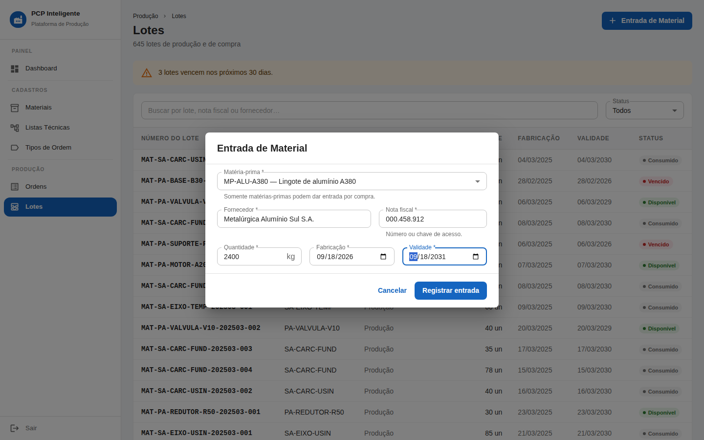
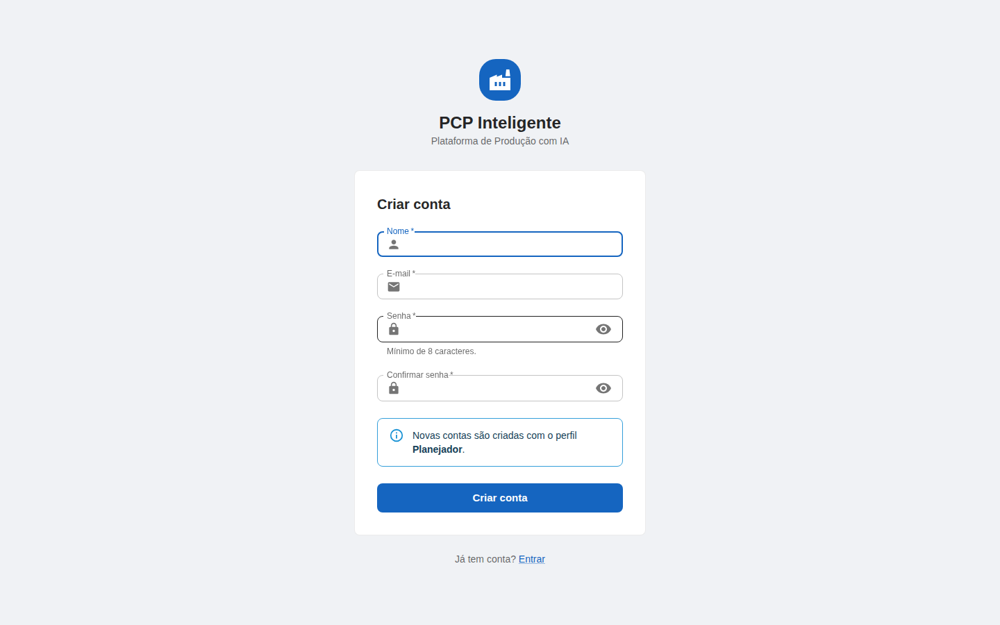
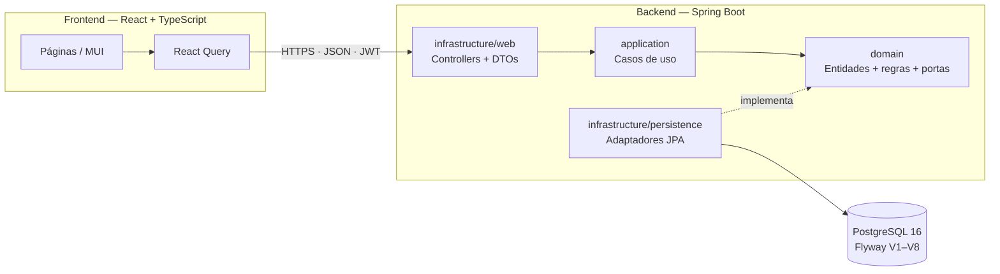
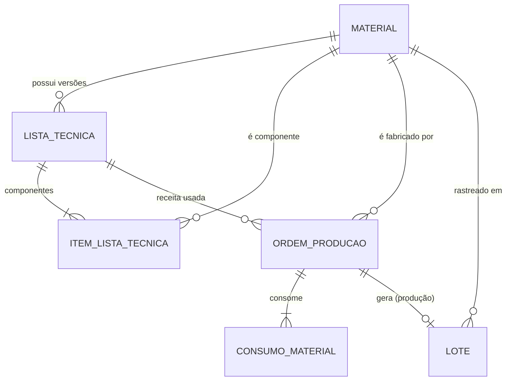

<div align="center">

# 🏭 PCP Inteligente

**Plataforma de Planejamento e Controle da Produção com rastreabilidade de ponta a ponta**

Do recebimento da matéria-prima ao lote do produto acabado — com lista técnica versionada,
consumo real × planejado e base de dados preparada para análise com IA.

[](https://github.com/Krsoliveira/pcp-inteligente-producao/actions/workflows/ci.yml)




</div>

---

## Sobre o projeto

Times de **PCP (Planejamento e Controle da Produção)** decidem *o que* produzir, *quanto*,
*quando* e *com quais recursos* — e, na prática, fazem isso com planilhas desconectadas e
pouca visibilidade de atrasos e perdas.

Este projeto modela o núcleo desse processo como um sistema real faria: materiais e
**listas técnicas (BOM) versionadas**, ordens de produção com **máquina de estados**,
**consumo de material com desvio justificado** e **lotes rastreáveis** — da nota fiscal do
fornecedor até o lote do produto acabado. É a base de dados sobre a qual o módulo de IA
(previsão de demanda e análise de atrasos) está sendo construído.

> Projeto de portfólio que une experiência em PCP, auditoria e engenharia de software.

## Destaques técnicos

| | |
|---|---|
| 🧱 **Clean Architecture + DDD** | Domínio em Java puro (sem Spring/JPA), portas e adaptadores, casos de uso explícitos. Regras de negócio vivem nas entidades — é impossível levar uma ordem a um estado inválido. |
| 🔁 **Regras de negócio reais** | BOM multinível com versionamento (só uma versão ativa), conclusão de ordem bloqueada sem consumos registrados e justificados, lote com origem única (produção **ou** compra) garantida no banco. |
| 🔐 **Segurança** | JWT stateless + BCrypt; autocadastro nunca concede privilégio (a regra está no backend, não só na tela); credenciais do administrador só em variáveis de ambiente; erros no padrão RFC 9457. |
| 🧪 **Qualidade** | Mais de 100 testes de unidade + integração com **Testcontainers** (PostgreSQL real). Um teste carrega o dataset inteiro e valida as invariantes do domínio. |
| 🛡️ **DevSecOps** | CI com CodeQL, Semgrep, Gitleaks, Trivy, OWASP Dependency-Check e `npm audit`; Dependabot semanal. |
| 📊 **Engenharia de dados** | Gerador Python determinístico (pipeline load → transform → validate → export) com sazonalidade, gargalos e desvios — sinal real para a IA. Datas ancoradas no dia da carga. |
| 📝 **Decisões documentadas** | [10 ADRs](docs/README.md#índice-de-adrs) registram o *porquê* de cada escolha de arquitetura. |

## Funcionalidades

- **Materiais** — produto acabado, semiacabado e matéria-prima.
- **Listas técnicas (BOM)** — versionadas; ativar uma versão torna a anterior obsoleta.
- **Ordens de produção** — ciclo `Planejada → Liberada → Em produção → Concluída`, com
  consumo projetado automaticamente a partir da BOM.
- **Consumo de materiais** — planejado × consumido; todo desvio exige justificativa e responsável.
- **Lotes rastreáveis** — gerados na conclusão da ordem ou na **entrada de matéria-prima**
  (fornecedor e nota fiscal obrigatórios), com alerta de vencimento.
- **Dashboard** — total de ordens, atrasadas, em produção, concluídas e lotes disponíveis.
- **Autenticação** — login, autocadastro (perfil Planejador) e administrador inicial (Gerente).

## Telas

<table>
  <tr>
    <td width="50%"><br><sub><b>Ordem de produção</b> — BOM utilizada, consumo com desvio e lote gerado</sub></td>
    <td width="50%"><br><sub><b>Listas técnicas</b> — versões ativas e obsoletas por material</sub></td>
  </tr>
  <tr>
    <td width="50%"><br><sub><b>Entrada de material</b> — recebimento com fornecedor e nota fiscal</sub></td>
    <td width="50%"><br><sub><b>Cadastro</b> — validação no cliente e no servidor</sub></td>
  </tr>
</table>

## Arquitetura

A dependência aponta **sempre para dentro**: o domínio não conhece banco, web nem framework.



### Modelo de domínio



Detalhes em [docs/arquitetura.md](docs/arquitetura.md).

## Stack

| Camada | Tecnologias |
|---|---|
| **Backend** | Java 21, Spring Boot 3.5, Spring Security, JPA/Hibernate, Flyway, Bean Validation, springdoc-openapi (Swagger) |
| **Frontend** | React 18, TypeScript, Vite, Material UI, TanStack Query, Zustand, ECharts |
| **Dados** | PostgreSQL 16, gerador Python (biblioteca padrão) |
| **Testes** | JUnit 5, AssertJ, Testcontainers |
| **DevOps** | Docker Compose, GitHub Actions, Dependabot |

## Como rodar

**Pré-requisitos:** Docker Desktop, JDK 21, Maven e Node.js 20+.

```bash
# 1. Infraestrutura
cp .env.example .env
docker compose up -d

# 2. Backend — API em http://localhost:8080 · Swagger em /swagger-ui.html
cd backend
mvn spring-boot:run -Dspring-boot.run.profiles=dev,seed   # "seed" carrega o dataset (só em banco vazio)

# 3. Frontend — http://localhost:5173
cd ../frontend
npm install
npm run dev
```

Na tela de login, use **Criar conta**. Para testes completos: `mvn verify` no backend
(requer Docker, por causa do Testcontainers).

<details>
<summary><b>Usuário administrador (Gerente)</b></summary>

A API cria um usuário **GERENTE** na inicialização a partir de variáveis de ambiente — as
credenciais nunca vão para o código nem para o Git. No PowerShell:

```powershell
$env:ADMIN_NOME  = "Seu Nome"
$env:ADMIN_EMAIL = "seu@email.com"
$env:ADMIN_SENHA = "uma-senha-forte"
mvn spring-boot:run "-Dspring-boot.run.profiles=dev,seed"
```

Idempotente: se o e-mail já existir, nada muda (uma conta existente nunca é promovida).
</details>

<details>
<summary><b>Portas e serviços locais</b></summary>

| Serviço | Endereço |
|---|---|
| API REST | <http://localhost:8080/api/v1> |
| Swagger UI | <http://localhost:8080/swagger-ui.html> |
| Frontend | <http://localhost:5173> |
| PostgreSQL | `localhost:5433` (host 5433 → container 5432) |

O `docker-compose.yml` também sobe Redis e RabbitMQ, reservados para as próximas fases.
</details>

## Estrutura

```
├── backend/     # Spring Boot — domain · application · infrastructure
├── frontend/    # React + TypeScript
├── data/        # Gerador do dataset sintético (Python)
├── docs/        # Visão, arquitetura, glossário, ADRs e imagens
└── .github/     # CI (build, testes e segurança) e Dependabot
```

## Roadmap

| Fase | Entrega | Status |
|---|---|---|
| 0–4 | Fundação, API de ordens, autenticação JWT, dashboard, carga de dados | ✅ |
| 5a | Material + lista técnica (BOM) versionada | ✅ |
| 5b | Consumo de material, lotes, conclusão de ordem, dataset sintético, entrada de matéria-prima | ✅ |
| 5c | **Módulo de IA** — previsão de demanda, análise de atrasos e recomendações | 🔜 |
| 6 | Saldo de estoque, integrações simuladas (SAP, Power BI) e deploy (Render + Neon) | 🔜 |

Planejado para as próximas fases: cache com Redis, eventos com RabbitMQ e testes de
frontend (Vitest). Estado detalhado em [docs/proximos-passos.md](docs/proximos-passos.md).

## Documentação

- [Visão geral](docs/visao-geral.md) — problema, escopo e personas
- [Arquitetura](docs/arquitetura.md) — camadas, fluxos e convenções
- [Glossário](docs/glossario.md) — termos de PCP e técnicos
- [ADRs](docs/README.md#índice-de-adrs) — registro das decisões de arquitetura
- [Dados](data/README.md) — como o dataset sintético é gerado

---

<div align="center">
Desenvolvido por <a href="https://github.com/Krsoliveira">@Krsoliveira</a>
</div>
