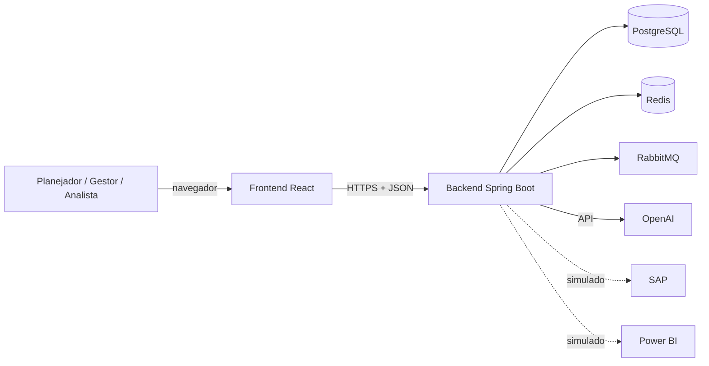
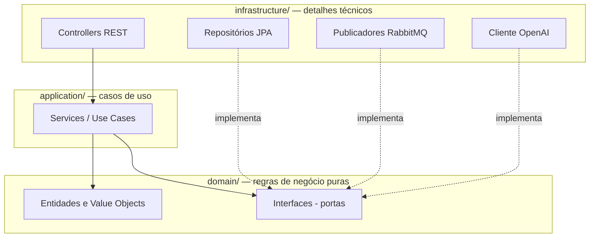
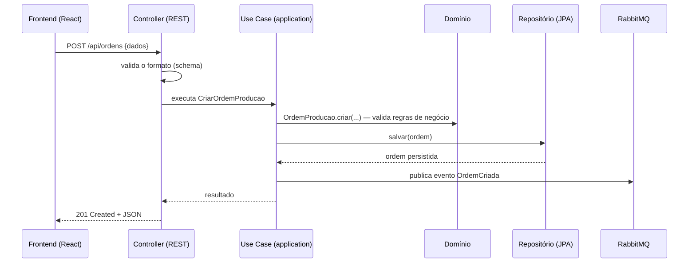

# Arquitetura

Este documento descreve **como** o sistema é organizado. O **porquê** de cada decisão
está nos [ADRs](adr/).

## Visão de contexto

Quem interage com o sistema e com o que o sistema conversa:



Linhas pontilhadas = integrações **simuladas** (imitam o contrato real sem depender de
licenças).

## Clean Architecture no backend

**Clean Architecture (arquitetura em camadas de cebola)**: o código é organizado em
anéis concêntricos. No centro, as regras de negócio; nas bordas, os detalhes técnicos
(banco, web, filas). A dependência aponta **sempre para dentro** — o domínio não conhece
o banco de dados, mas o banco de dados conhece o domínio.

*Analogia:* o chão de fábrica (domínio) define o produto e o processo; a logística
(infraestrutura) se adapta a ele — nunca o contrário.



### As três camadas

| Camada | Pasta | Contém | Regra |
|---|---|---|---|
| **Domínio** | `domain/` | Entidades (`OrdemProducao`), value objects, regras de negócio, interfaces (portas) | Java puro. Zero dependência de framework |
| **Aplicação** | `application/` | Casos de uso (ex.: `CriarOrdemProducao`), orquestração | Depende só do domínio |
| **Infraestrutura** | `infrastructure/` | Controllers, JPA, RabbitMQ, OpenAI, configurações Spring | Implementa as portas do domínio |

**Porta (interface de saída)** → o domínio declara *o que precisa* ("preciso salvar uma
ordem") como interface Java; a infraestrutura fornece *como fazer* (JPA + PostgreSQL).
*Exemplo prático:* a interface `OrdemProducaoRepository` vive no domínio; a classe
`OrdemProducaoRepositoryJpa` vive na infraestrutura. Nos testes, trocamos por uma
implementação em memória — e o domínio nem percebe.

## Fluxo de dados de uma requisição

Exemplo: o planejador cria uma ordem de produção.



O evento publicado no RabbitMQ permite que módulos como a IA reajam de forma
**assíncrona** (sem travar a resposta ao usuário).

## Papel de cada tecnologia

| Tecnologia | Papel | Equivalente cotidiano |
|---|---|---|
| PostgreSQL | Banco de dados relacional — fonte da verdade | O arquivo oficial da fábrica |
| Redis | Cache — respostas frequentes em memória | Post-it com a informação mais pedida |
| RabbitMQ | Mensageria — eventos entre módulos ([ADR-0002](adr/0002-rabbitmq-mensageria.md)) | Esteira interna de recados |
| OpenAI | Motor de IA ([ADR-0003](adr/0003-openai-provedor-ia.md)) | Consultor especializado sob demanda |
| Flyway | Migrações de banco versionadas | Histórico de reformas do prédio, em ordem |
| Swagger/OpenAPI | Documentação viva da API | Catálogo dos serviços que a API oferece |

## Frontend

- **React + TypeScript** — interface tipada (erros pegos em tempo de compilação).
- **React Query** — busca e cache de dados do servidor (estado *do servidor*).
- **Zustand** — estado *da interface* (filtros abertos, tema, seleções).
- **Material UI** — componentes visuais prontos e consistentes.
- **ECharts** — gráficos do dashboard.

Separação importante: React Query cuida do que vem da API; Zustand cuida do que só
existe na tela. Não misturar os dois evita duplicação de estado.

## Infraestrutura local

Todo o ambiente de desenvolvimento sobe com um comando na raiz do projeto:

```bash
docker compose up -d
```

| Serviço | Porta (host) | Para quê |
|---|---|---|
| PostgreSQL 16 | `5433` (evita conflito com PostgreSQL nativo na 5432) | Banco de dados |
| Redis 7 | `6379` | Cache |
| RabbitMQ 3 | `5672` / UI: `15672` | Mensageria (interface web de administração na 15672) |

Credenciais ficam no arquivo `.env` (copiado de `.env.example`), que **nunca** é
versionado no Git.

## Convenções do projeto

- **Idioma**: domínio e documentação em português (`OrdemProducao`); termos técnicos
  consagrados permanecem em inglês (`Repository`, `Controller`).
- **Testes**: toda regra de domínio nasce com teste unitário; integrações com banco
  usam Testcontainers (PostgreSQL real em container descartável).
- **Commits**: mensagens no padrão Conventional Commits (`feat:`, `fix:`, `docs:` ...).
- **Segurança**: nenhum segredo em código ou Git — o CI roda Gitleaks para garantir.
